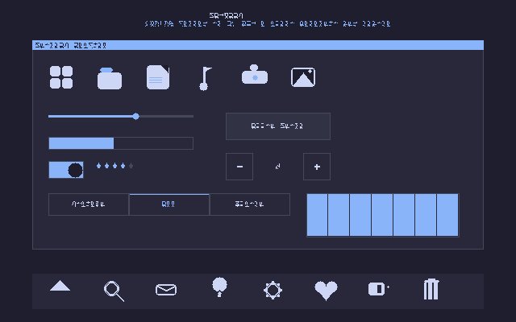

# KairoOS


## Preview



*Concept dell'interfaccia (mockup), non uno screenshot reale del sistema in esecuzione.*

## Active Development

The main development branch is **`main`**.

This repository hosts the **KairoOS Computer** kernel (x86-64 PC), not the **KairoTouch** mobile variant (ARM64).

## Build

```bash
make
bash iso/mkiso.sh
```

## Run in QEMU

```bash
# Direct boot (PVH)
./boot.sh

# Boot from ISO (UEFI)
./boot.sh iso

# Boot from ISO (Legacy BIOS)
./boot.sh iso-bios
```

## What is KairoOS?

KairoOS is a **single-developer** hobby OS made with passion. Boot it in QEMU or a VM and explore.

### Features

- Kernel **x86-64** scritto in **C + ASM**
- Boot **Multiboot2 / PVH** (UEFI e Legacy BIOS)
- Avvio da **ISO** o boot diretto su **QEMU** / VM
- Struttura modulare: `kernel/`, `boot/`, `iso/`, `dist/`

## Structure

- `kernel/` — kernel sources (C, ASM)
- `boot/` — boot stubs (GDT, IDT, loader)
- `iso/` — ISO build scripts
- `dist/` — distribution files
